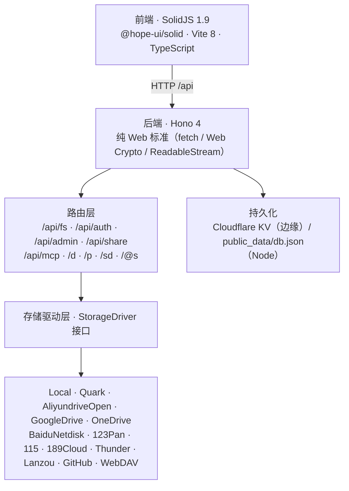

<p align="center">
  
</p>

<h1 align="center">NextList</h1>

<p align="center">
  <b>一个现代化的全栈文件列表 / 网盘管理系统</b><br />
  OpenList 的定制全栈分支：用轻量级 Node.js（Hono + TypeScript）后端替代原版 Go 后端，<br />
  部署更轻、启动更快，无需编译 Go 二进制。
</p>

<p align="center">
  <a href="#-项目简介">项目简介</a> ·
  <a href="#-功能特性">功能特性</a> ·
  <a href="#-技术架构">技术架构</a> ·
  <a href="#-支持的存储驱动">存储驱动</a> ·
  <a href="#-快速开始">快速开始</a> ·
  <a href="#-部署方法">部署方法</a> ·
  <a href="#-相关项目">相关项目</a>
</p>

---

## ✨ 项目简介

NextList 是一款**开箱即用的私有网盘 / 文件列表站**：把本地目录、各种网盘和 WebDAV 服务器统一挂载到一个现代网页界面中，支持浏览、预览、上传下载、分享与后台管理。

- 全栈 TypeScript：前端（SolidJS）与后端（Hono）同语言、类型共享，无 Go 编译链
- 边缘优先：核心后端只用 Web 标准（`fetch` / `Web Crypto` / `ReadableStream`），一套代码部署到 Cloudflare Workers / Vercel / EdgeOne / AWS Lambda / Node 容器
- 驱动抽象：统一的 `StorageDriver` 接口，接入新网盘只需实现一个类
- 零数据库依赖：配置、存储、用户全部持久化为 JSON 文件（容器）或 Cloudflare KV（边缘）

本项目是 [OpenList](https://github.com/OpenListTeam/OpenList) 的分支 / 衍生实现，完整保留其前端体验，并重写了后端与存储驱动层。

---

## 🚀 功能特性

| 类别       | 功能                                                                                                                                               |
| ---------- | -------------------------------------------------------------------------------------------------------------------------------------------------- |
| 文件浏览   | 列表 / 网格浏览、搜索、排序、分页、目录树                                                                                                          |
| 文件管理   | 上传、下载、新建文件夹、重命名、移动、复制、批量重命名、删除空目录                                                                                 |
| 打包下载   | 文件 / 文件夹 ZIP 打包下载（浏览器流式生成）                                                                                                       |
| 文件预览   | PDF、Markdown（数学公式 / Mermaid / 语法高亮）、代码（Monaco）、Office（docx / pptx / xlsx）、图片画廊、视频 / 音频（字幕 / 弹幕 / 歌词 / HLS）    |
| 分享链接   | 创建分享（提取码 / 密码 / 过期时间 / 禁用）、分享页浏览 `/@s/`、分享下载 `/sd/`                                                                    |
| 下载加速   | 直链下载、HTTP Range 断点续传、代理下载 `/d` `/p`                                                                                                  |
| 账户与安全 | JWT 认证、用户管理、密码保护路由、后台管理（存储 / 设置 / 元数据 / 插件）                                                                          |
| 插件系统   | ZIP 上传 / URL 安装、可视化配置、悬浮挂件 / 文件操作扩展 / 主题 / 预览（与 OpenListNext 插件格式双向兼容，[开发指南](docs/plugin-development.md)） |
| 多存储挂载 | 13 种存储驱动统一挂载，支持跨存储复制                                                                                                              |
| 备份恢复   | 配置 / 存储 / 用户 JSON 备份与恢复                                                                                                                 |
| 离线下载   | 基础实现（Serverless 环境受限）                                                                                                                    |
| AI 集成    | MCP 协议支持（`/api/mcp`），可向 AI 工具暴露文件操作能力                                                                                           |
| 个性化     | 黑暗模式、国际化（中文 / English）、站点设置                                                                                                       |

---

## 🧱 技术架构



### 核心设计

| 设计点               | 说明                                                                                                                       |
| -------------------- | -------------------------------------------------------------------------------------------------------------------------- |
| **全栈 TypeScript**  | 前端与后端同语言，类型共享，无 Go 编译链                                                                                   |
| **纯 Web 标准**      | 后端只用 `fetch` / `Web Crypto` / `ReadableStream`，无 `fs` / `http` 等 Node.js 模块依赖（Local 驱动在 Node 环境按需加载） |
| **驱动抽象**         | 统一的 `StorageDriver` 接口（list / get / mkdir / rename / remove / move / copy），接入新网盘只需实现一个类                |
| **多平台运行**       | 同一套代码可部署到 Node.js 容器、Cloudflare Workers、Vercel、EdgeOne、AWS Lambda                                           |
| **JSON / KV 持久化** | 配置、存储、用户、分享全部存 JSON（容器）或 KV（边缘），无数据库依赖                                                       |

---

## 🗂️ 支持的存储驱动

| 驱动                         | 说明                                                                 |
| ---------------------------- | -------------------------------------------------------------------- |
| **Local** 本地文件系统       | 文件映射到 `public_data/`，仅 Node 容器模式可用                      |
| **Quark** 夸克网盘           | Cookie / 请求头直链                                                  |
| **AliyundriveOpen** 阿里云盘 | OAuth2                                                               |
| **OneDrive** / SharePoint    | OAuth2，refresh token 自动持久化                                     |
| **Google Drive**             | OAuth2                                                               |
| **BaiduNetdisk** 百度网盘    | 官方 / 破解下载、分片上传、秒传                                      |
| **123Pan** 123 云盘          | token-first 登录，规避境外 IP 风控                                   |
| **115** 网盘                 | 开放平台，token 自动持久化                                           |
| **189Cloud** 天翼云盘        | Cookie 持久化                                                        |
| **Thunder** 迅雷云盘         | 普通 / Expert 双模式                                                 |
| **Lanzou** 蓝奏云            | Cookie 持久化                                                        |
| **GitHub**                   | 仓库文件即存储                                                       |
| **WebDAV**                   | 挂载任意 WebDAV 服务器（Nextcloud / ownCloud / Synology / Alist 等） |

> [!NOTE]
> 除 Local 外所有驱动均可在 Cloudflare Workers 上运行；123 云盘在 Workers 出口 IP 上可能触发服务端登录风控，详见 [部署指南](docs/deploy-cloudflare-workers.md)。

---

## 🚀 快速开始

### 环境要求

- Node.js ≥ 20.19（Vite 8 要求，推荐 22 LTS）
- 包管理器：`pnpm` 9+（推荐）或 `npm`

### 安装依赖

```bash
pnpm install
# 或
npm install
```

### 本地开发

```bash
pnpm dev
```

同时启动 Vite 前端与 Hono 后端开发服务器，访问 <http://localhost:3000>。

### 管理凭据（默认）

| 项     | 值      |
| ------ | ------- |
| 用户名 | `admin` |
| 密码   | `admin` |

> [!WARNING]
> 首次部署后请务必在「用户管理」中修改默认密码。

### 本地文件系统（Local 驱动）

本地驱动将文件上传、读取、下载直接映射到 `public_data/` 目录；站点配置与存储配置持久化为 `public_data/db.json`。容器部署时将该目录挂载为数据卷即可持久化。

---

## 🔄 Fork 自动同步上游

本仓库内置 **Sync with Upstream** 工作流（[.github/workflows/sync_upstream.yml](.github/workflows/sync_upstream.yml)）。Fork 本仓库后，运行该工作流即可自动拉取上游 [Mcchen1008/NextList](https://github.com/Mcchen1008/NextList) 的最新代码，合并到你 Fork 的分支：

1. Fork 本仓库后，打开你 Fork 的 **Actions** 页面，按提示启用 workflows（首次需点击确认）。
2. 进入 **Sync with Upstream** → **Run workflow**。
3. 可选参数：
   - `branch`：要同步的分支（默认 `main`）。
   - `method`：`merge`（保留你的本地提交、产生合并提交，默认）或 `rebase`（线性历史）。
4. 运行完成后你的 Fork 即与上游同步；也可在 Fork 的 Actions 设置中启用定时任务自动同步。

> ⚠️ 冲突处理：若你 Fork 中的本地修改与上游冲突，工作流会失败并输出提示。此时请在本地 `git fetch upstream` 后手动解决冲突，或改为提交 Pull Request 合并上游变更。

---

## 📦 部署方法

| 方式                           | 命令                    | 说明                                                                                  |
| ------------------------------ | ----------------------- | ------------------------------------------------------------------------------------- |
| **Cloudflare Workers**（推荐） | `pnpm deploy`           | 自动检测 / 创建 KV namespace，构建并部署，静态资源由 ASSETS binding 托管              |
| **EdgeOne Makers**             | 控制台导入仓库即可      | Node 云函数 + Blob 存储 + SPA 兜底，原生支持，详见 [docs/edgeone.md](docs/edgeone.md) |
| **Vercel**                     | `pnpm build` 后平台导入 | 前端静态资源输出到 `dist/`，API 由 `api/[...route].ts` Serverless 句柄提供            |
| **AWS Lambda**                 | `pnpm sls:deploy`       | 基于 `serverless.yml` 与 `handler.ts`                                                 |
| **本地开发**                   | `pnpm dev`              | Vite + Hono 一体化开发服务器（端口 3000）                                             |

### 方式一：Cloudflare Workers（推荐，免费边缘部署）

```bash
# 一键部署（自动检测 / 创建 KV namespace，无需手动填写 KV id）
pnpm deploy

# 或分步执行：
npx wrangler login                    # 1) 登录 Cloudflare
node scripts/deploy.js --kv           # 2) 确保 KV namespace 存在
pnpm deploy:worker                    # 3) 部署
pnpm dev:worker                       # 本地预览（wrangler dev）
```

`pnpm deploy` 会自动完成：检测 `NEXTLIST_KV` namespace（不存在则自动创建）→ 构建前端 → `wrangler deploy`。部署后配置数据持久化在 KV 中，静态资源由 `ASSETS` binding 托管。

可选环境变量：`CF_ACCOUNT_ID` / `CF_API_TOKEN` / `CF_KV_NAMESPACE_ID`（供脚本自动创建 KV 时使用）。

详细步骤见 [docs/deploy-cloudflare-workers.md](docs/deploy-cloudflare-workers.md)。

### 方式二：腾讯云 EdgeOne Makers（原生支持）

项目内置 `edgeone.json`、Node 云函数入口（`cloud-functions/[[default]].js`）、边缘中间件（`middleware.js`）与 `@edgeone/pages-blob` 持久化适配：

1. 在 [EdgeOne Makers 控制台](https://console.edgeone.ai/makers) 导入 Git 仓库，平台自动读取 `edgeone.json` 完成构建。
2. 存储无需手动配置：配置数据自动持久化到 Blob 存储（`nextlist_db` 命名空间）。
3. 部署后通过 `*.edgeone.cool` 域名访问，默认管理账号 `admin` / `admin`。

详细步骤见 [docs/edgeone.md](docs/edgeone.md)。

### 方式三：Vercel / AWS Lambda

```bash
# 生产构建：Vite 前端（dist/）+ esbuild 边缘后端（dist/api/[...route].js）
pnpm build
```

- **Vercel**：仓库根目录的 `vercel.json` 会自动识别 `api/[...route].ts`（Hono Vercel 句柄）与 `dist/` 静态资源
- **AWS Lambda**：`pnpm sls:deploy` 基于 `serverless.yml` 部署，`handler.ts` 导出 Lambda 句柄

### 方式四：Node 容器 / 自托管

> [!IMPORTANT]
> 本项目是**边缘优先**架构：`npm run start` 加载的是 Serverless 句柄产物（`dist/api/[...route].js`，Vercel 格式），**不包含端口监听**，因此不能直接当作常驻服务启动。
>
> 在 Node 环境下自托管时，需要自行用 `@hono/node-server`（依赖已内置）启动该句柄，并额外托管 `dist/` 静态资源。本地开发请使用 `pnpm dev`，生产环境推荐 Cloudflare Workers 或 Vercel。

---

## ⚙️ 环境变量

| 变量             | 默认值  | 说明                                           |
| ---------------- | ------- | ---------------------------------------------- |
| `VITE_API_URL`   | `/api`  | 前端请求的后端 API 地址                        |
| `ADMIN_USERNAME` | `admin` | 管理员初始用户名                               |
| `ADMIN_PASSWORD` | `admin` | 管理员初始密码                                 |
| `DATABASE_JSON`  | -       | 可选：自定义 JSON 数据结构，覆盖默认数据库状态 |

---

## 🔌 API 概览

| 路径            | 说明                                                                                   |
| --------------- | -------------------------------------------------------------------------------------- |
| `/api/fs`       | 文件列表、目录树、上传、下载、新建 / 重命名 / 移动 / 复制 / 删除、批量重命名、离线下载 |
| `/api/auth`     | 登录 / 登出 / 当前用户（`/api/me`）/ 修改密码                                          |
| `/api/admin`    | 后台管理：存储 CRUD 与启停、驱动列表、设置、元数据、KV 状态                            |
| `/api/share`    | 分享 CRUD（列表 / 创建 / 更新 / 删除 / 启停）                                          |
| `/api/public`   | 公开配置（预览设置、归档扩展名等）                                                     |
| `/api/mcp`      | MCP 协议支持                                                                           |
| `/api/debug`    | 调试接口                                                                               |
| `/api/health`   | 健康检查（品牌 / 版本 / 环境）                                                         |
| `/@s/{id}`      | 分享页浏览路径（经 `/api/fs` 解析）                                                    |
| `/d` `/p` `/sd` | 直链下载 / 代理 / 分享下载                                                             |

---

## 📁 项目结构

```text
.
├── api/                  # Serverless 入口（Vercel / EdgeOne / Lambda 句柄）
├── docs/                 # 部署与使用文档
├── public/               # 静态资源（logo、favicon、manifest 等）
├── public_data/          # Node 运行时的数据目录（db.json / 上传文件）
├── scripts/              # 部署 / i18n / 回归测试脚本
├── src/
│   ├── app/              # 前端入口（SolidJS）
│   ├── components/       # 前端组件（Markdown、播放器、文件树等）
│   ├── pages/            # 页面（浏览、管理后台、关于等）
│   ├── lang/             # 国际化（中文 / English）
│   ├── store/            # 前端状态管理
│   ├── types/            # 前后端共享类型
│   ├── utils/            # 工具函数
│   └── backend/          # Hono 后端
│       ├── drivers/      # 存储驱动（Local / 各网盘 / WebDAV）
│       ├── internal/     # 核心逻辑（driver 基类 / model / op / stream）
│       ├── pkg/          # 公共工具（crypto / http / stream 等）
│       ├── server/       # 路由层（fs / auth / admin / share / mcp ...）
│       ├── index.ts      # 应用组装（API + 静态资源 catch-all）
│       └── worker.ts     # Cloudflare Workers 入口
├── build.sh              # 发布构建脚本（--release / --lite）
├── vercel.json           # Vercel 配置
├── edgeone.json          # EdgeOne 配置
├── serverless.yml        # AWS Lambda 配置
└── wrangler.toml         # Cloudflare Workers 配置（KV binding）
```

---

## 🛠️ 开发指南

| 命令                                    | 说明                                                     |
| --------------------------------------- | -------------------------------------------------------- |
| `pnpm dev`                              | 开发服务器（Vite + Hono 一体，端口 3000）                |
| `pnpm build`                            | 生产构建（Vite 前端 + esbuild 边缘后端）                 |
| `pnpm start`                            | 加载 Serverless 句柄（见上文「Node 容器 / 自托管」说明） |
| `pnpm dev:worker`                       | 本地模拟 Cloudflare Workers（`wrangler dev`）            |
| `pnpm deploy`                           | 一键部署 Cloudflare Workers（自动创建 KV）               |
| `pnpm sls:deploy`                       | 部署 AWS Lambda（Serverless Framework）                  |
| `pnpm lint`                             | TypeScript 类型检查（`tsc --noEmit`）                    |
| `pnpm format`                           | Prettier 格式化                                          |
| `pnpm i18n:build` / `pnpm i18n:release` | Crowdin 国际化同步与构建                                 |

### 测试

`scripts/` 目录包含无需额外框架的回归测试脚本（以 `tsx` 运行）：

```bash
npx tsx scripts/test-workers-env.mts   # Workers 环境兼容性回归
npx tsx scripts/test-share.mts         # 分享流程测试
npx tsx scripts/test-backup-flow.mts   # 备份 / 恢复流程测试
npx tsx scripts/test-webdav.mts        # WebDAV 服务端全流程测试（认证 / PROPFIND / 上传下载 / MOVE / COPY / 权限）
```

> [!NOTE]
> `scripts/test-task-api.mts` 及 Workers 回归中 2 项任务用例已随 `/api/task` 路由移除而过时（返回 404），待清理。

---

## ❓ 常见问题

**Q：为什么 Local 驱动在 Cloudflare Workers 上不可用？**

Workers 是无文件系统环境。Local 驱动仅在 Node 容器模式可用（按需动态加载 `fs`）；边缘部署请使用网盘 / WebDAV 等远程存储驱动。

**Q：123 云盘在 Workers 部署时提示「境外登录风险」？**

这是 123 服务端对数据中心 / 陌生 IP 登录的风控策略，Go 原版 OpenList 同样会触发。推荐在本地浏览器登录后抓取 `access_token` 填入存储配置，或部署到境内服务器。详见 [部署指南](docs/deploy-cloudflare-workers.md)。

**Q：数据存在哪里？**

Node 容器模式持久化到 `public_data/db.json`；Cloudflare Workers 模式持久化到绑定的 `NEXTLIST_KV` namespace。

**Q：支持 WebDAV 吗？**

双向支持：既可以把远程 WebDAV 服务器（Nextcloud、ownCloud、Synology 等）作为存储驱动挂载进来，也对外提供完整的 WebDAV 服务端（`/dav` 端点，RFC 4918 Class 1/2），可直接被 Windows 资源管理器、macOS Finder、rclone 等客户端挂载。详见 [WebDAV 使用指南](docs/webdav.md)。

**Q：`npm run start` 为什么不能直接启动服务？**

`dist/api/[...route].js` 是 Serverless 句柄产物，不包含端口监听。项目以边缘部署为主要形态；Node 自托管需自行接入 `@hono/node-server` 并托管静态资源。

**Q：默认账号密码是什么？**

`admin` / `admin`，首次部署后请立即修改。

---

## 📚 文档与资源

- [Cloudflare Workers 部署指南](docs/deploy-cloudflare-workers.md)
- [WebDAV 使用指南](docs/webdav.md)（Windows / macOS / rclone 挂载配置）
- [OpenList 官方文档](https://doc.oplist.org/)（配置 / 驱动 / FAQ，与本项目高度兼容）

---

## 🤝 相关项目

| 项目                  | 说明                                                              | 链接                                             |
| --------------------- | ----------------------------------------------------------------- | ------------------------------------------------ |
| **OpenListNext**      | JS/TS 内核上游（OpenList 的 Serverless 重构版），插件格式双向兼容 | <https://github.com/Polonium-salts/openlistnext> |
| **OpenList**          | 本项目的上游原版（Go 后端）                                       | <https://github.com/OpenListTeam/OpenList>       |
| **OpenList Docs**     | 官方文档（配置 / 驱动 / FAQ）                                     | <https://doc.oplist.org/>                        |
| **AList**             | OpenList 的前身，开箱即用的文件列表程序                           | <https://github.com/alist-org/alist>             |
| **OpenList 在线 API** | 部分网盘驱动的 token 获取服务                                     | <https://api.oplist.org/>                        |

---

## 📄 许可证

[GNU Affero General Public License v3.0 (AGPL-3.0)](LICENSE)

---

<p align="center">
  <b>Powered by NextList</b> · 由 <a href="https://github.com/OpenListTeam/OpenList">OpenList 社区</a> 驱动
</p>
